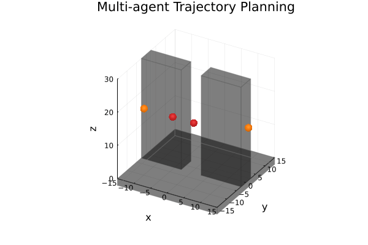

# Michi-Tsubaki (Michitoshi Tsubaki)

## Undergraduate student at JSK Robotics Lab. at Department of Mechano-Informatics, Faculty of Engineering, the University of Tokyo 

## Interests
- Control, Optimization, Mechatronics, Robotics

## Feel free to contact me anytime!👍

- **Email :** michi.tsubaki.tech@gmail.com, tsubaki@jsk.t.u-tokyo.ac.jp

## For more information
Please visit my web page below.
https://kanazawanaoaki.github.io/

### Tips (Japanese)
#### Julia Packages
ROS2, DualQuatUtils

#### 経路計画
- マルチエージェントの確率的軌道最適化を3次元に拡張（Julia）
[リポジトリ](https://github.com/Michi-Tsubaki/MultiAgentTrajectoryPlanning/tree/tsubaki/make-door-example-3d)
[ノートブック](https://michi-tsubaki.github.io/Michi-Tsubaki/notebook/Multi-agent-in-3d-space.html)

#### 数理最適化
- JuMPのtutorial (Julia)
【ノートブック】
[LP(1)](https://michi-tsubaki.github.io/Michi-Tsubaki/notebook/JuMP-tutorial-LP-1.html)
[LP(2)](https://michi-tsubaki.github.io/Michi-Tsubaki/notebook/JuMP-tutorial-LP-2.html)
[QP(1)](https://michi-tsubaki.github.io/Michi-Tsubaki/notebook/JuMP-tutorial-QP-1.html)
[QP(2)](https://michi-tsubaki.github.io/Michi-Tsubaki/notebook/JuMP-tutorial-QP-2.html)
